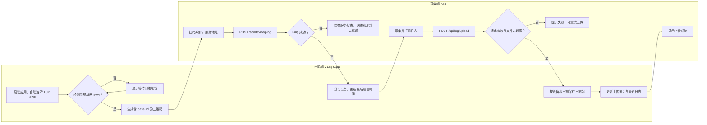
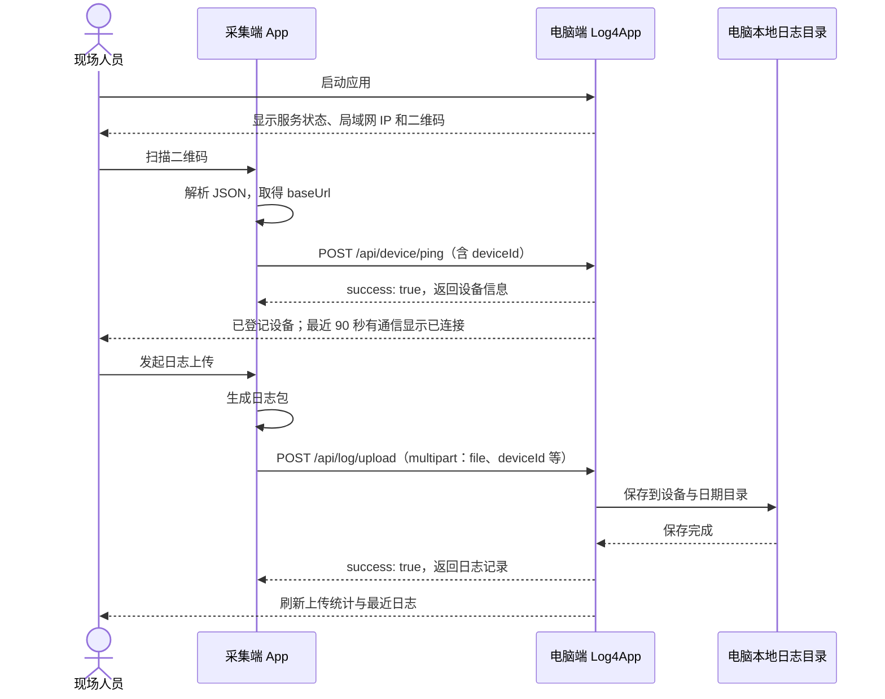

# Log4App 与采集端 App 业务流程

本图描述推荐的扫码接入与日志上传协议流程。Log4App 运行在电脑上，采集端 App 运行在需要导出日志的设备上；两端须处于可互访的局域网。具体采集端按钮名称以其实际版本为准。接口细节见 [Server API](SERVER_API.md)。

## 业务流程图

## 请求时序

扫码取得地址后，推荐先调用设备 Ping，方便桌面端立即显示设备。上传接口本身也会登记或更新设备；旧接口 `GET /api/log/ping` 只检查连通性，不会登记设备。设备列表和本次上传统计保存在当前运行会话中，日志文件会持久化到电脑本地。
